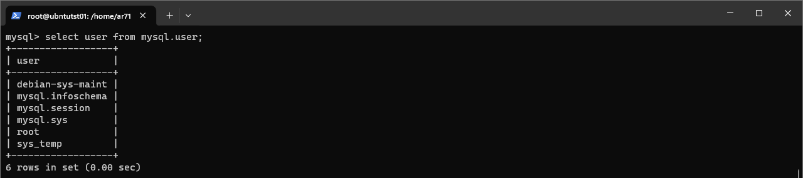
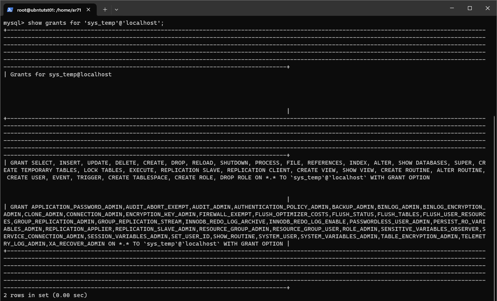
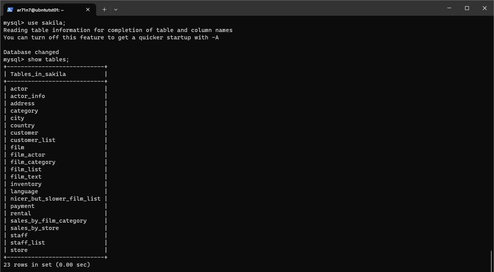

# Домашнее задание к занятию «Работа с данными (DDL/DML)»

---

Задание можно выполнить как в любом IDE, так и в командной строке.

## Задание 1

### Задание
1.1. Поднимите чистый инстанс MySQL версии 8.0+. Можно использовать локальный сервер или контейнер Docker. 

1.2. Создайте учётную запись sys_temp.

1.3. Выполните запрос на получение списка пользователей в базе данных. (скриншот)

1.4. Дайте все права для пользователя sys_temp.

1.5. Выполните запрос на получение списка прав для пользователя sys_temp. (скриншот)

1.6. Переподключитесь к базе данных от имени sys_temp.

Для смены типа аутентификации с sha2 используйте запрос: 
```sql
ALTER USER 'sys_test'@'localhost' IDENTIFIED WITH mysql_native_password BY 'password';
```

1.6. По ссылке https://downloads.mysql.com/docs/sakila-db.zip скачайте дамп базы данных.

1.7. Восстановите дамп в базу данных.

1.8. При работе в IDE сформируйте ER-диаграмму получившейся базы данных. При работе в командной строке используйте команду для получения всех таблиц базы данных. (скриншот)

*Результатом работы должны быть скриншоты обозначенных заданий, а также простыня со всеми запросами.*

### Ответ

#### 1.3

#### 1.5

#### 1.8


<details>

<summary>Простыня со всеми запросами</summary>

```
mysql> GRANT ALL PRIVILEGES ON *.* TO 'sys_temp'@'localhost' WITH GRANT OPTION;
...
mysql> ALTER USER 'sys_temp'@'localhost' IDENTIFIED WITH mysql_native_password BY '*****';
...
ar71n7@ubntutst01:~$ mysql -u sys_temp -p
Enter password:
Welcome to the MySQL monitor.  Commands end with ; or \g.
Your MySQL connection id is 21
Server version: 8.0.36-0ubuntu0.22.04.1 (Ubuntu)

Copyright (c) 2000, 2024, Oracle and/or its affiliates.

Oracle is a registered trademark of Oracle Corporation and/or its
affiliates. Other names may be trademarks of their respective
owners.

Type 'help;' or '\h' for help. Type '\c' to clear the current input statement.

mysql> create database sakila;
Query OK, 1 row affected (0.04 sec)

mysql> ^DBye
ar71n7@ubntutst01:~$ mysql -u sys_temp -p sakila < /home/ar71n7/sakila-db/sakila-schema.sql
Enter password:
ar71n7@ubntutst01:~$ mysql -u sys_temp -p sakila < /home/ar71n7/sakila-db/sakila-data.sql
Enter password:
ar71n7@ubntutst01:~$ mysql -u sys_temp -p
Enter password:
Welcome to the MySQL monitor.  Commands end with ; or \g.
Your MySQL connection id is 24
Server version: 8.0.36-0ubuntu0.22.04.1 (Ubuntu)

Copyright (c) 2000, 2024, Oracle and/or its affiliates.

Oracle is a registered trademark of Oracle Corporation and/or its
affiliates. Other names may be trademarks of their respective
owners.

Type 'help;' or '\h' for help. Type '\c' to clear the current input statement.

mysql> show databases;
+--------------------+
| Database           |
+--------------------+
| information_schema |
| mysql              |
| performance_schema |
| sakila             |
| sys                |
+--------------------+
5 rows in set (0.00 sec)

mysql> use sakila;
Reading table information for completion of table and column names
You can turn off this feature to get a quicker startup with -A

Database changed
mysql> show tables;
+----------------------------+
| Tables_in_sakila           |
+----------------------------+
| actor                      |
| actor_info                 |
| address                    |
| category                   |
| city                       |
| country                    |
| customer                   |
| customer_list              |
| film                       |
| film_actor                 |
| film_category              |
| film_list                  |
| film_text                  |
| inventory                  |
| language                   |
| nicer_but_slower_film_list |
| payment                    |
| rental                     |
| sales_by_film_category     |
| sales_by_store             |
| staff                      |
| staff_list                 |
| store                      |
+----------------------------+
23 rows in set (0.00 sec)

mysql>
```
</details>

---

## Задание 2
### Задание
Составьте таблицу, используя любой текстовый редактор или Excel, в которой должно быть два столбца: в первом должны быть названия таблиц восстановленной базы, во втором названия первичных ключей этих таблиц. Пример: (скриншот/текст)
```
Название таблицы | Название первичного ключа
customer         | customer_id
```

### Ответ

```
actor           |   actor_id
actor_info      |      
address         |   address_id
category        |   category_id
city            |   city_id
country         |   country_id
customer        |   customer_id
customer_list
film            |   film_id
film_actor      |   actor_id
                    film_id
film_category   |   film_id
                    category_id
film_list
film_text       |   film_id
inventory       |   inventory_id
language        |   language_id
nicer_but_slower_film_list
payment         |   payment_id
rental          |   rental_id
sales_by_film_category
sales_by_store
staff           |   staff_id
staff_list
store           |   store_id