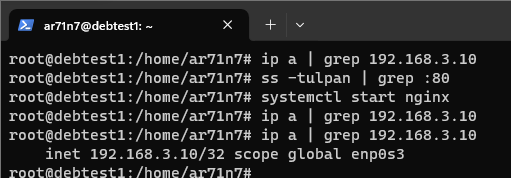

# Домашнее задание к занятию «Disaster recovery и Keepalived»


## Задание 1

### Задание
- Дана [схема](files/hsrp_advanced.pkt) для Cisco Packet Tracer, рассматриваемая в лекции.
- На данной схеме уже настроено отслеживание интерфейсов маршрутизаторов Gi0/1 (для нулевой группы)
- Необходимо аналогично настроить отслеживание состояния интерфейсов Gi0/0 (для первой группы).
- Для проверки корректности настройки, разорвите один из кабелей между одним из маршрутизаторов и Switch0 и запустите ping между PC0 и Server0.
- На проверку отправьте получившуюся схему в формате pkt и скриншот, где виден процесс настройки маршрутизатора.


### Ответ
Настройки роутеров на скриншоте и в приложенных конфигурационных файлах.
Первая проверка на скрине до удаления линка, вторая проверка после.
Также поправил приоритеты, чтобы всегда была разница 5 в рамках группы.


- [Cхема](files/hsrp_advanced_ar71n7.pkt)
- [Router1_running-config](files/Router1_running-config.txt)
- [Router2_running-config](files/Router2_running-config.txt)


## Задание 2

### Задание
- Запустите две виртуальные машины Linux, установите и настройте сервис Keepalived как в лекции, используя пример конфигурационного [файла](files/keepalived-simple.conf).
- Настройте любой веб-сервер (например, nginx или simple python server) на двух виртуальных машинах
- Напишите Bash-скрипт, который будет проверять доступность порта данного веб-сервера и существование файла index.html в root-директории данного веб-сервера.
- Настройте Keepalived так, чтобы он запускал данный скрипт каждые 3 секунды и переносил виртуальный IP на другой сервер, если bash-скрипт завершался с кодом, отличным от нуля (то есть порт веб-сервера был недоступен или отсутствовал index.html). Используйте для этого секцию vrrp_script
- На проверку отправьте получившейся bash-скрипт и конфигурационный файл keepalived, а также скриншот с демонстрацией переезда плавающего ip на другой сервер в случае недоступности порта или файла index.html


### Ответ
- Bash-скрипт nginx_check.sh для отслеживания порта и файла
```bash
#!/bin/bash

d=`ss -tulpan | grep :80 | wc -l`
if [[ $d -ne 0 ]];
  then
    res=$?
  else
    res=$?
fi

if [ -f /usr/share/nginx/html/index.html ];
  then
    resf=$?
  else
    resf=$?
fi

if [[ $res -ne 0 || $resf -ne 0 ]];
  then
    exit 1
fi
```

- Конфигурационный файл keepalived
```bash
vrrp_script nginx {
  script "/home/ar71n7/nginx_check.sh"
  interval 3
}


vrrp_instance VI_1 {
  state MASTER
  interface enp0s3
  virtual_router_id 51
  priority 100
  advert_int 1
  virtual_ipaddress {
      192.168.3.10
    }

  track_script {
    nginx
  }
}
```

- Скриншот переезда IP адреса в случае недоступности
