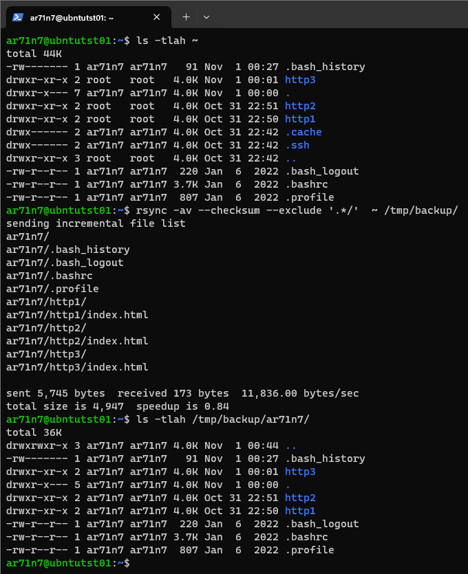
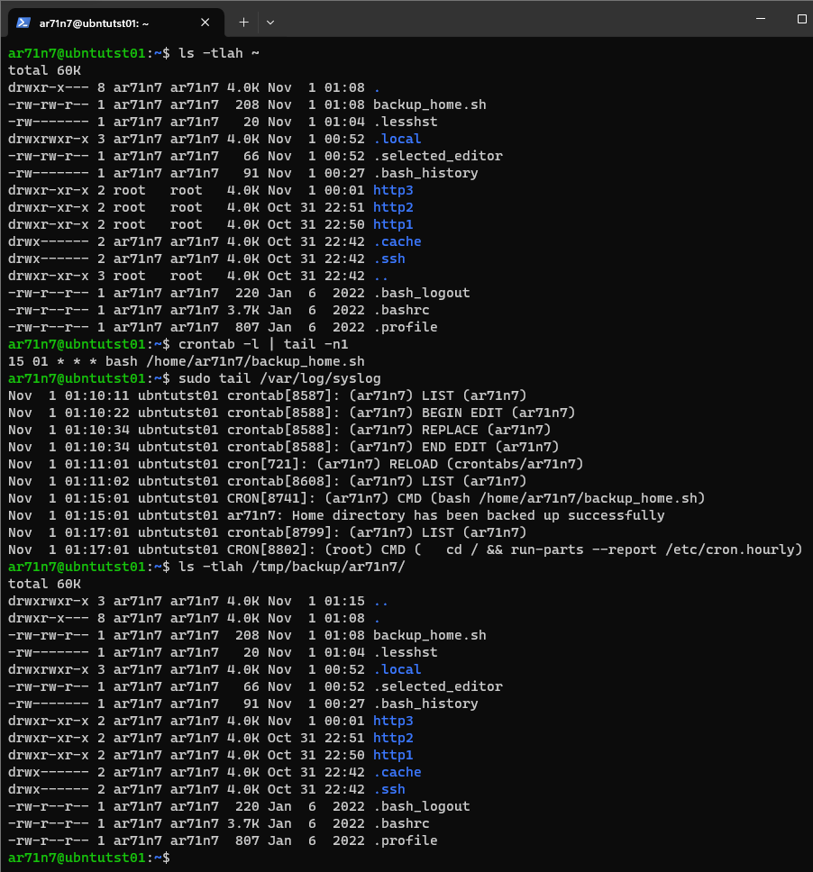

# Домашнее задание к занятию «Резервное копирование»


## Задание 1

### Задание
- Составьте команду rsync, которая позволяет создавать зеркальную копию домашней директории пользователя в директорию `/tmp/backup`
- Необходимо исключить из синхронизации все директории, начинающиеся с точки (скрытые)
- Необходимо сделать так, чтобы rsync подсчитывал хэш-суммы для всех файлов, даже если их время модификации и размер идентичны в источнике и приемнике.
- На проверку направить скриншот с командой и результатом ее выполнения

### Ответ
- Команда rsync, которая позволяет создавать зеркальную копию домашней директории пользователя в директорию `/tmp/backup`
  ```bash
  bash rsync -a ~ /tmp/backup/
  ```

- Команда rsync, которая позволяет создавать зеркальную копию домашней директории пользователя в директорию 
`/tmp/backup`, но с исключеним из синхронизации всех директорий, начинающихся с точки (скрытые)
  ```bash
  bash rsync -a --exclude '.*/' ~ /tmp/backup/
  ```

- Команда rsync, которая позволяет создавать зеркальную копию домашней директории пользователя в директорию 
`/tmp/backup`, но с исключеним из синхронизации всех директорий, начинающихся с точки (скрытые), а также с
подсчетом хэш-суммы для всех файлов, даже если их время модификации и размер идентичны в источнике и приемнике
  ```bash
  bash rsync -av --checksum --exclude '.*/'  ~ /tmp/backup/ 
  ```
- Скриншот выполнения конечной команды rsync



## Задание 2

### Задание
- Написать скрипт и настроить задачу на регулярное резервное копирование домашней директории пользователя с помощью rsync и cron.
- Резервная копия должна быть полностью зеркальной
- Резервная копия должна создаваться раз в день, в системном логе должна появляться запись об успешном или неуспешном выполнении операции
- Резервная копия размещается локально, в директории `/tmp/backup`
- На проверку направить файл crontab и скриншот с результатом работы утилиты.

### Ответ
- Скрипт backup_home.sh
  ```bash
  #!/bin/bash
  
  rsync -a /home/ar71n7 /tmp/backup/
  stat=$?
  
  if [[ $stat -eq 0 ]];
    then
      logger "Home directory has been backed up successfully"
    else
      logger "Attempt to backup home directory has been failed"
  fi
  ```

- Скриншот с содержимым crontab и результатом работы скрипта
