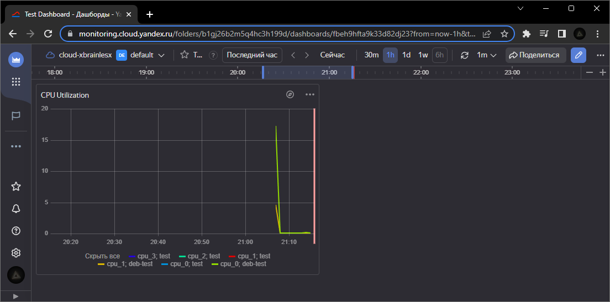

# Домашнее задание к занятию «Обзор систем IT-мониторинга»
 
## Задание 1

### Задание
Создайте виртуальную машину в Yandex Compute Cloud и с помощью Yandex Monitoring создайте дашборд, на котором будет видно загрузку процессора.

### Ответ
