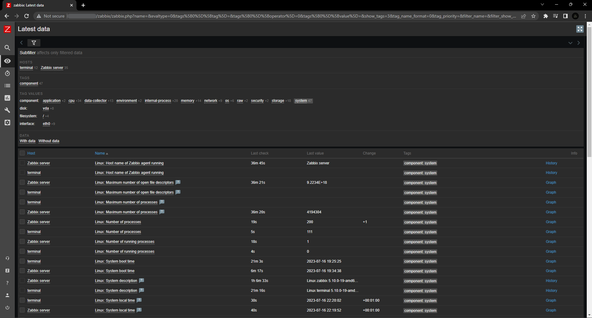

# Домашнее задание к занятию «Система мониторинга Zabbix»

## Задание 1 

### Задание
Установите Zabbix Server с веб-интерфейсом.

#### Процесс выполнения
1. Выполняя ДЗ сверяйтесь с процессом отражённым в записи лекции.
2. Установите PostgreSQL. Для установки достаточна та версия что есть в системном репозитороии Debian 11
3. Пользуясь конфигуратором комманд с официального сайта, составьте набор команд для установки последней версии Zabbix с поддержкой PostgreSQL и Apache
4. Выполните все необходимые команды для установки Zabbix Server и Zabbix Web Server

#### Требования к результаты 
1. Прикрепите в файл README.md скриншот авторизации в админке
2. Приложите в файл README.md текст использованных команд в GitHub

### Ответ


1. Install Zabbix repository
    ```
    # wget https://repo.zabbix.com/zabbix/6.0/debian/pool/main/z/zabbix-release/zabbix-release_6.0-4+debian11_all.deb
    # dpkg -i zabbix-release_6.0-4+debian11_all.deb
    # apt update
    ```
2. Install Zabbix server, frontend, agent
    ```
    # apt install postgresql zabbix-server-pgsql zabbix-frontend-php php7.4-pgsql zabbix-apache-conf zabbix-sql-scripts zabbix-agent
    ```
3. Create initial database 
    ```
    # sudo -u postgres createuser --pwprompt zabbix
    # sudo -u postgres createdb -O zabbix zabbix
    # zcat /usr/share/zabbix-sql-scripts/postgresql/server.sql.gz | sudo -u zabbix psql zabbix
    ```
4. Configure the database for Zabbix server, set up password to access DB 
   ```
   # nano /etc/zabbix/zabbix_server.conf
   ```
5. Start Zabbix server and agent processes and make it start at system boot.
   ```
   # systemctl restart zabbix-server zabbix-agent apache2
   # systemctl enable zabbix-server zabbix-agent apache2
   ```
   
---

## Задание 2

### Задание
Установите Zabbix Agent на два хоста.

#### Процесс выполнения
1. Выполняя ДЗ сверяйтесь с процессом отражённым в записи лекции.
2. Установите Zabbix Agent на 2 виртмашины, одной из них может быть ваш Zabbix Server
3. Добавьте Zabbix Server в список разрешенных серверов ваших Zabbix Agentов
4. Добавьте Zabbix Agentов в раздел Configuration > Hosts вашего Zabbix Servera
5. Проверьте что в разделе Latest Data начали появляться данные с добавленных агентов

#### Требования к результаты 
1. Приложите в файл README.md скриншот раздела Configuration > Hosts, где видно, что агенты подключены к серверу
2. Приложите в файл README.md скриншот лога zabbix agent, где видно, что он работает с сервером
3. Приложите в файл README.md скриншот раздела Monitoring > Latest data для обоих хостов, где видны поступающие от агентов данные.
4. Приложите в файл README.md текст использованных команд в GitHub

### Ответ



1. Install Zabbix repository
   ```
   # wget https://repo.zabbix.com/zabbix/6.0/debian/pool/main/z/zabbix-release/zabbix-release_6.0-4+debian11_all.deb
   # dpkg -i zabbix-release_6.0-4+debian11_all.deb
   # apt update
   ```
2. Install Zabbix agent2
   ```
   # apt install zabbix-agent2 zabbix-agent2-plugin-*
   ```
3. Configure Zabbix agent — указываем IP zabbix-сервера в Server и ServerActive, а также Hostname
   ```
   # nano /etc/zabbix/zabbix_agent2.conf
   ```
   Для скриншота лога пришлось временно сменить DebugLevel на 4
4. Start Zabbix agent2 process and make it start at system boot.
   ```
   # systemctl restart zabbix-agent2
   # systemctl enable zabbix-agent2
   ```