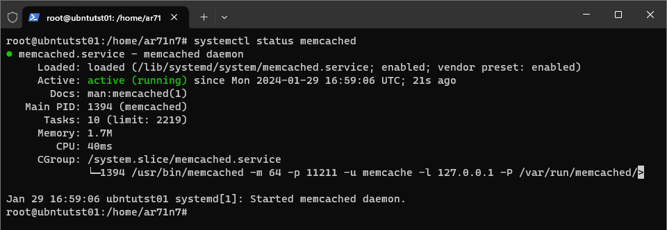
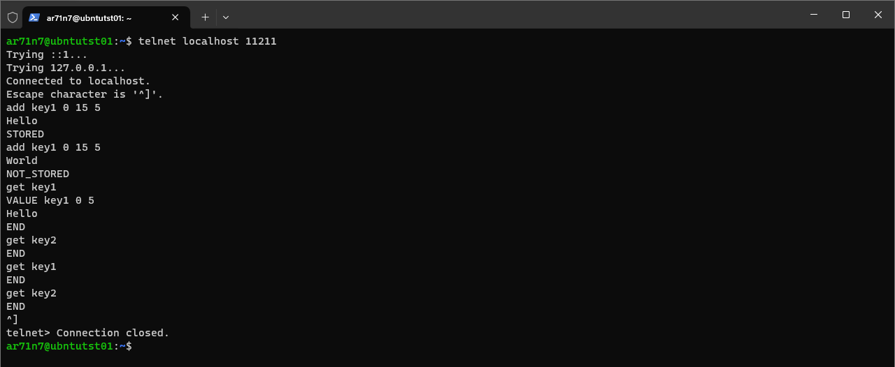
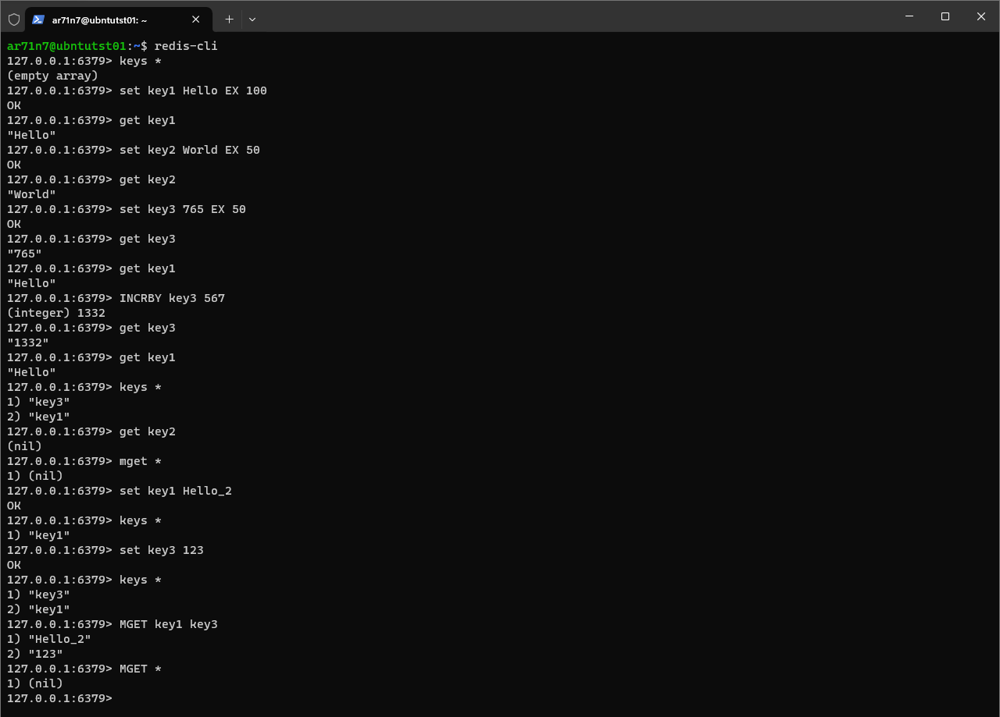

# Домашнее задание к занятию «Кеширование Redis/memcached»

## Задание 1. Кеширование 

### Задание
Приведите примеры проблем, которые может решить кеширование. 

*Приведите ответ в свободной форме.*

### Ответ
В общем виде кэширование решает проблему недостатка производительности при доступе к данным при помощи временного хранения части данных в более производительной области памяти.
Примеры конкретных решаемых проблем:
- Уменьшение числа запросов к базам данных
- Ускорение времени загрузки веб-страниц
- Распределение нагрузки с помощью CDN

---

## Задание 2. Memcached

### Задание
Установите и запустите memcached.

*Приведите скриншот systemctl status memcached, где будет видно, что memcached запущен.*

### Ответ

---

## Задание 3. Удаление по TTL в Memcached

### Задание
Запишите в memcached несколько ключей с любыми именами и значениями, для которых выставлен TTL 5. 

*Приведите скриншот, на котором видно, что спустя 5 секунд ключи удалились из базы.*

### Ответ
TTL 15 секунд (5 секунд слишком быстро, а писать скрипт долго)

---

## Задание 4. Запись данных в Redis

### Задание
Запишите в Redis несколько ключей с любыми именами и значениями. 

*Через redis-cli достаньте все записанные ключи и значения из базы, приведите скриншот этой операции.*

### Ответ
