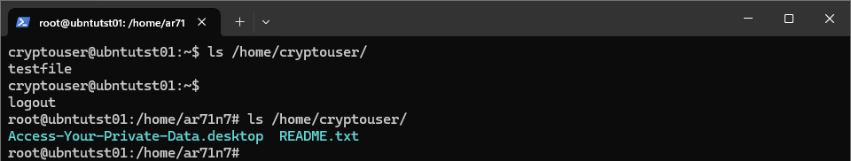
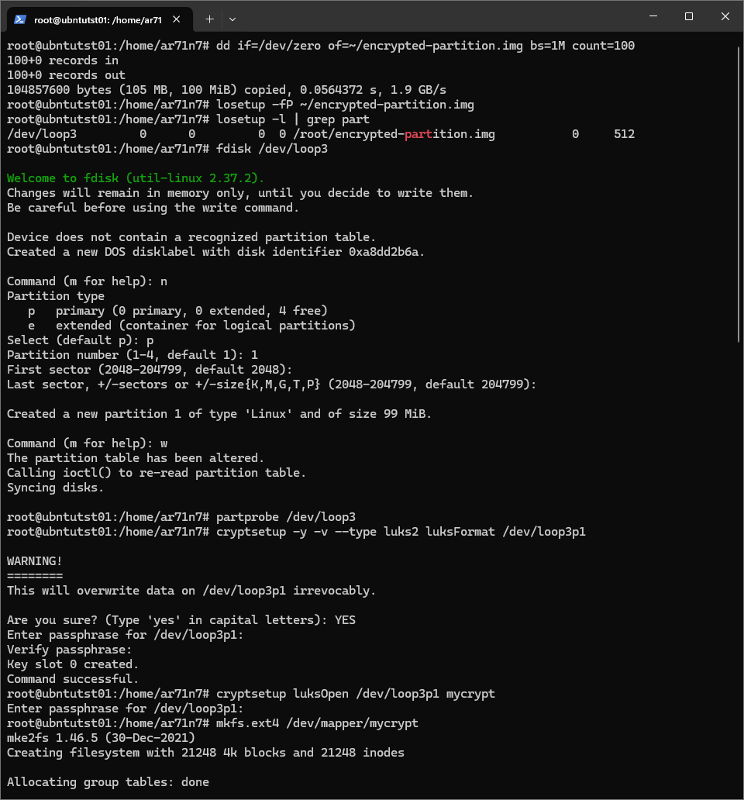
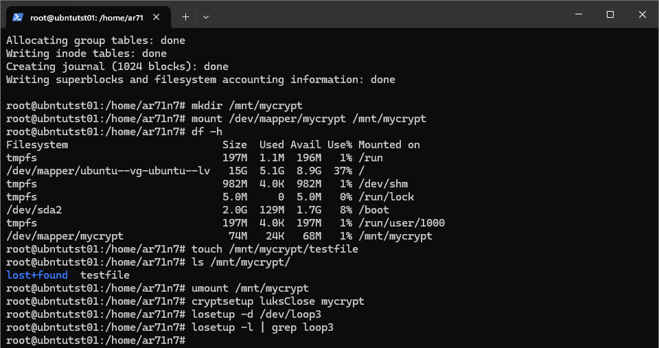

# Домашнее задание к занятию  «Защита хоста»

## Задание 1
### Задание
1. Установите **eCryptfs**.
2. Добавьте пользователя cryptouser.
3. Зашифруйте домашний каталог пользователя с помощью eCryptfs.

*В качестве ответа пришлите снимки экрана домашнего каталога пользователя с исходными и зашифрованными данными.*

### Ответ


## Задание 2
### Задание
1. Установите поддержку **LUKS**.
2. Создайте небольшой раздел, например, 100 Мб.
3. Зашифруйте созданный раздел с помощью LUKS.

*В качестве ответа пришлите снимки экрана с поэтапным выполнением задания.*

### Ответ
```
apt install cryptsetup
cryptsetup --version
dd if=/dev/zero of=~/encrypted-partition.img bs=1M count=100
losetup -fP ~/encrypted-partition.img
losetup -l | grep part
fdisk /dev/loop3
partprobe /dev/loop3
cryptsetup -y -v --type luks2 luksFormat /dev/loop3p1
cryptsetup luksOpen /dev/loop3p1 mycrypt
mkfs.ext4 /dev/mapper/mycrypt
mkdir /mnt/mycrypt
mount /dev/mapper/mycrypt /mnt/mycrypt
umount /mnt/mycrypt
cryptsetup luksClose mycrypt
losetup -d /dev/loop3
losetup -l | grep loop3
```

